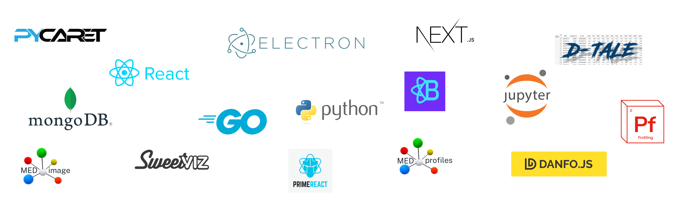

# MEDomicsLab: Integrative Modeling of Heterogeneous Data in Medicine

  <picture>
    
  </picture>

## Table of Contents 
- [What is MEDomicsLab?](#what-is-medomicslab)
- [MEDomicsLab Components](#medomicslab-components)
- [MEDomicsLab Modules](#medomicslab-modules)
- [MEDomicsLab in Action](#medomicslab-in-action)
- [Installation and Usage](#installation-and-usage)
- [Explore Documentation](#explore-documentation)
- [Engage in MEDomicsLab](#engage-in-medomicslab)

## What is MEDomicsLab?
**MEDomicsLab** is an open-source platform designed to advance medical AI by bridging 
clinical and computational research. It empowers clinicians to design experiments, 
enables computer scientists to customize and adapt them, and refines processes with a 
flexible backend. The platform offers multiple usage levels: intuitive built-in pipelines, 
customizable settings, automatic code generation, and modular Python libraries—enhancing 
collaboration and innovation across healthcare professionals and data scientists.

## MEDomicsLab Overview
**MEDomicsLab** is focused on integrative modeling of heterogeneous medical data to 
support personalized treatments. The platform offers an environment for manipulating 
heterogeneous medical data and developing predictive models to enable the characterization 
of biological processes.

  <picture width="600">
    
  </picture>

The end-goal is to give researchers the ability to leverage diverse 
data types contributing to more personalized and effective treatment models by enhancing the 
synergy between computer scientists and clinical researchers, in particular, through the code
generation feature that allows for the automatic generation of Python code from the graphically created pipelines as depicted below.

  <picture width="600">
    
  </picture>

## MEDomicsLab Components
**MEDomicsLab** uses a modular workflow (see the figure below), detailing how patient data is processed 
to develop and test predictive models for clinical use. The workflow consists of several 
key modules that are grouped into the following layers:

- **Design layer**: The workflow begins in the Design Layer, where various types of input data are integrated to support the analytical process. This includes DICOM images and tabular data in CSV format, such as time series and clinical text data from notes or reports. Data flows first to the [Extraction Module](https://medomics-udes.gitbook.io/medomicslab-docs/tutorials/design/extraction-modules), which performs feature extraction to identify critical characteristics—like radiomic features from medical images using the [MEDimage package](https://medimage.app). The extracted data is then processed in the [Input Module](https://medomics-udes.gitbook.io/medomicslab-docs/tutorials/design/input-module), which provides extensive functionalities including cleaning empty lines, merging tables, and removing correlated features. It also offers a tagging tool that allows users to organize dataset columns, and offers a graphical implementation of the [MEDprofiles package](https://github.com/MEDomics-UdeS/MEDprofiles) for patient data treatment and visualization. Finally, the [Exploratory Module](https://medomics-udes.gitbook.io/medomicslab-docs/tutorials/design/exploratory-module) can be utilized to assess data characteristics visually or statistically, with tools like [Sweetviz](https://github.com/fbdesignpro/sweetviz), [D-Tale](https://github.com/man-group/dtale), and [ydata-profiling](https://github.com/ydataai/ydata-profiling).

- **Development Layer**: Once features have been extracted and treated, it enters the Development Layer. This layer includes key modules for model training and testing. The [Learning Module](https://medomics-udes.gitbook.io/medomicslab-docs/tutorials/development/learning-module) allows users to experiment with different machine learning (ML) models to determine the best-performing algorithms for a given clinical endpoint. After model experimentation, the ML module can help finalize a model ready for evaluation and saves it under the MEDomicsLab format: "*.medmodel*". Next, the [Evaluation Module](https://medomics-udes.gitbook.io/medomicslab-docs/tutorials/development/evaluation-module) enables model validation by testing it on new data and explaining its performance and outcomes using the [explainerdashboard package](https://github.com/oegedijk/explainerdashboard). For models that require distributed data sources for training, a graphical implementation of the [MEDfl package](https://github.com/MEDomics-UdeS/MEDfl) for Federated Learning (FL) is included, allowing users to train models across decentralized data sources without transferring patient data. This ensures patient privacy and supports collaborative research across institutions.

- **Deployment Layer** : After finalizing and evaluating a model, it’s ready to be used in the [Application Module](https://medomics-udes.gitbook.io/medomicslab-docs/tutorials/deployment/application-module). This module enables users to apply the trained model to new datasets or patient data, making it accessible for clinical use. Additionally, the standardized "*.medmodel*" format plays a crucial role in facilitating collaboration, allowing models to be shared seamlessly across teams and ensuring compatibility and ease of integration in diverse environments.

  <picture width="600">
    
  </picture>

## MEDomicsLab in Action
Explore MEDomicsLab's powerful features through this tutorial, highlighting its intuitive interface and versatile tools for data analysis.

  

## Installation and Usage
[Get started here](https://medomics-udes.gitbook.io/medomicslab-docs/quick-start).

### Explore Documentation
Detailed documentation for MEDomicsLab can be found 
[here](https://medomics-udes.gitbook.io/medomicslab-docs/).

### Engage in MEDomicsLab
Explore our [contribution page](https://medomics-udes.gitbook.io/medomicslab-docs/contributing) 
for resources on contributing to MEDomicsLab and setting up your development environment.

### Acknowledgement

This project relies on the following open-source packages, and we are grateful to their developers:

  <picture width="600">
    
  </picture>

