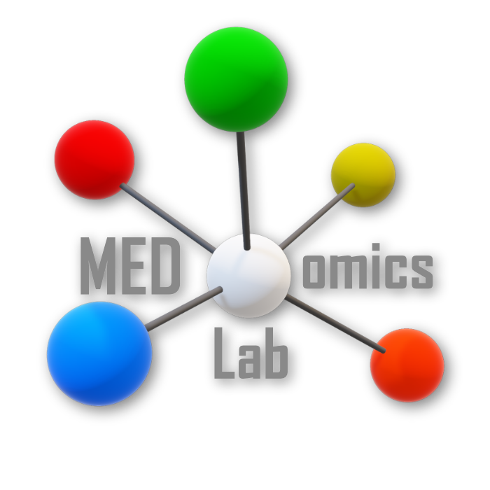

# MEDomicsLab: Integrative Modeling of Heterogeneous Data in Medicine

  <picture>
    
  </picture>

## What is MEDomicsLab?
**MEDomicsLab** is an open-source platform designed to advance medical AI by bridging 
clinical and computational research. It empowers clinicians to design experiments, 
enables computer scientists to customize and adapt them, and refines processes with a 
flexible backend. The platform offers multiple usage levels: intuitive built-in pipelines, 
customizable settings, automatic code generation, and modular Python libraries—enhancing 
collaboration and innovation across healthcare professionals and data scientists.

## MEDomicsLab overview
**MEDomicsLab** is focused on integrative modeling of heterogeneous medical data to 
support personalized treatments. The platform offers an environment for manipulating 
heterogeneous medical data and developing predictive models to enable the characterization 
of biological processes. The end-goal is to give researchers the ability to leverage diverse 
data types contributing to more personalized and effective treatment models by enhancing the 
synergy between several disciplines.

  <picture width="600">
    
  </picture>

## MEDomicsLab modules
**MEDomicsLab** platform uses a modular workflow, detailing how patient data is processed 
to develop and test predictive models for clinical use. The workflow consists of several 
key modules:

1. [**Input Module**](https://medomics-udes.gitbook.io/medomicslab-docs/tutorials/design/input-module).
2. [**Extraction Module**](https://medomics-udes.gitbook.io/medomicslab-docs/tutorials/design/extraction-modules).
3. [**Exploratory Module**](https://medomics-udes.gitbook.io/medomicslab-docs/tutorials/design/exploratory-module).
4. [**Learning Module**](https://medomics-udes.gitbook.io/medomicslab-docs/tutorials/development/learning-module).
5. [**Evaluation Module**](https://medomics-udes.gitbook.io/medomicslab-docs/tutorials/development/evaluation-module).
6. [**Application Module**](https://medomics-udes.gitbook.io/medomicslab-docs/tutorials/deployment/application-module).

Each module supports the transition from raw data to clinically relevant predictive modeling 
in a customizable way.

  <picture width="600">
    
  </picture>

## MEDomicsLab in Action
Explore MEDomicsLab's powerful features through these snapshots, 
highlighting its intuitive interface and versatile tools for medical data analysis.

  
  
   
  
  
  

## Installation and Usage
[Get started here](https://medomics-udes.gitbook.io/medomicslab-docs/quick-start).

### Explore documentation
Detailed documentation for MEDomicsLab can be found 
[here](https://medomics-udes.gitbook.io/medomicslab-docs/).

### Engage in MEDomicsLab
Explore our [contribution page](https://medomics-udes.gitbook.io/medomicslab-docs/contributing) 
for resources on contributing to MEDomicsLab and setting up your development environment.

